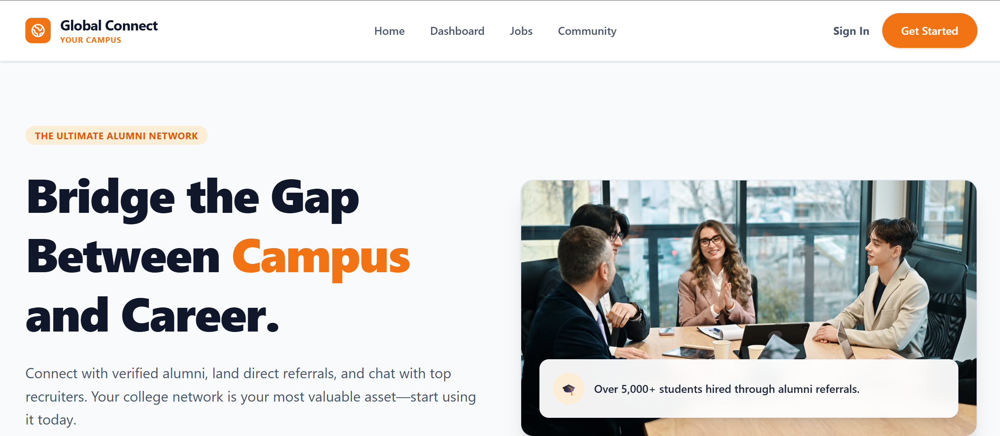
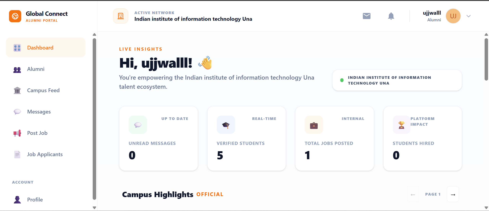
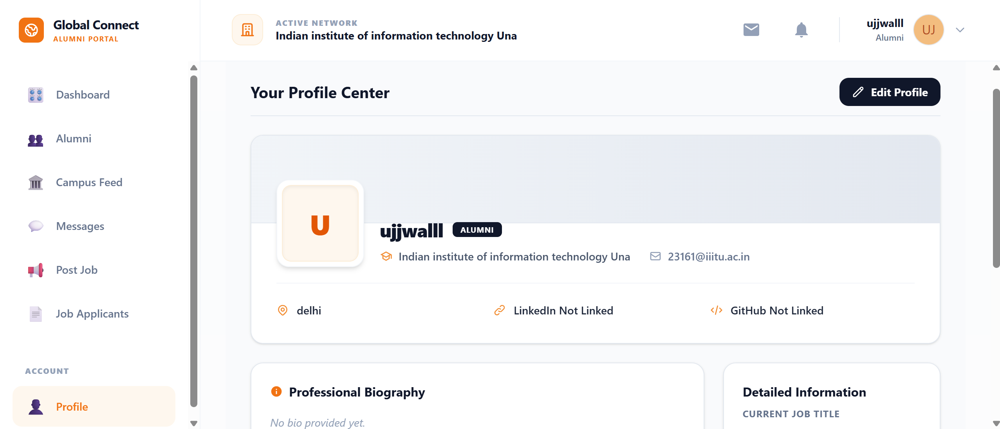
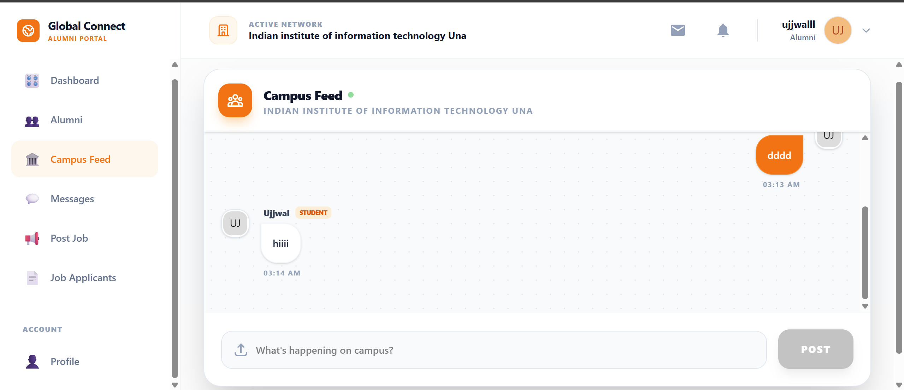
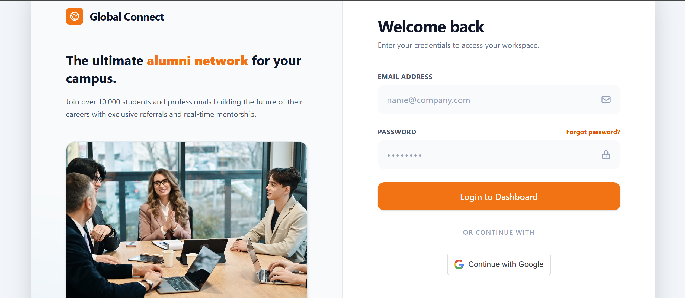

# Global Connect: Multi-Tenant Alumni & Recruitment Ecosystem


<br>
*A glimpse into the Global Connect platform*

**Global Connect** is a professional networking platform designed to bridge the gap between students, alumni, and recruiters within institutional ecosystems. Built with a focus on security, role-based access control (RBAC), and real-time engagement.

---

## 🚀 Core Value Proposition
Unlike generic social networks, Global Connect implements a **Curated Professional Model**:
* **Recruiter Versatility**: Recruiters have the flexibility to join various campus networks (regardless of their own alma mater) to source talent directly from diverse institutional pools.
* **Controlled Access**: Students can only message recruiters once a recruiter has initiated the conversation, keeping the recruitment process professional and spam-free for hiring managers.
* **Institutional Integrity**: Students and Alumni are verified by campus admins, ensuring a network of high-trust individuals.

---

## 🛠 Tech Stack
* **Frontend**: React.js, Tailwind CSS, React Router v6, React Hook Form.
* **Backend**: Node.js, Express.js.
* **Database**: MongoDB (Aggregations, Complex Sub-document schemas).
* **Real-time**: Socket.io (Instant messaging & Global Notifications).
* **Security**: JWT (HttpOnly Cookies), Google OAuth 2.0.
* **Storage**: Cloudinary (Avatar & Document handling).
* **Email**: Resend (Transactional verification and status updates).

---

## 🌟 Key Features

### 1. Multi-Tenant Context Switching
Users can belong to multiple institutional networks. A recruiter can manage talent pipelines for **IIIT Una** in the morning and switch to **Stanford University** in the afternoon. The system allows "Live Switching," pivoting all dashboard stats and data instantly without requiring a re-login.


<br>
*Role-based dashboard adapting to the active membership context*

### 2. Streamlined Recruitment Pipeline
* **Applicant Management**: Recruiters can view all candidates for a specific job, download resumes, and visit student profiles with a single click.
* **Direct Communication**: Recruiters can initiate chat with any applicant to ask clarifying questions or schedule interviews.
* **Status Tracking**: Manage the hiring funnel with status updates (Pending → Shortlisted → Rejected).


<br>
*Detailed user profiles for quick candidate evaluation and networking*

### 3. Professional Communication Gateway
* **Socket-driven real-time chat** for instant coordination.
* **Directional Messaging**: Prevents mass-messaging of recruiters by students; the conversation starts only when a recruiter reaches out.
* **Profile Integration**: Chat headers link directly to user profiles for quick context during conversations.


<br>
*Real-time messaging with integrated profile routing*

---

## 🏗 System Architecture (FAANG Highlights)

### Traffic-Cop Routing Logic
Implemented a centralized `handleRoleBasedRouting` system that manages the user lifecycle and handles redirects for "Guest" users (preventing logged-in users from accessing Login/Register pages via a custom `PublicRoute` guard).


<br>
*Secure, role-aware authentication portal*

### Context-Aware Backend
Controllers are designed to be "College-Agnostic." All queries are scoped to the `activeMembership` context. If a recruiter switches their active college, the backend automatically scopes all job posts and candidate lists to that specific institution.

### Resilient Data Sanitization
Automatic fallback logic for membership removal. If a user leaves their active network, the system intelligently pivots to their next verified institution or gracefully resets the context, ensuring zero frontend crashes or "Dead ID" errors.

---

## 🔑 Environment Configuration

To run this project, create a `.env` file in your **backend** directory and provide the following variables:

```env
PORT=8000
MONGODB_URI=your_mongodb_connection_string
CORS_ORIGIN=http://localhost:5173
NODE_ENV=development

# Authentication Secrets
ACCESS_TOKEN_SECRET=your_long_random_string
ACCESS_TOKEN_EXPIRY=1d
REFRESH_TOKEN_SECRET=your_long_random_string
REFRESH_TOKEN_EXPIRY=10d

# Google OAuth 2.0
GOOGLE_CLIENT_ID=your_google_client_id
GOOGLE_CLIENT_SECRET=your_google_client_secret
GOOGLE_REDIRECT_URI=http://localhost:8000/api/user/google-callback

# External Services
GEMINI_API_KEY=your_google_ai_studio_key
RESEND_API_KEY=your_resend_api_key
CLOUDINARY_CLOUD_NAME=your_cloud_name
CLOUDINARY_API_KEY=your_api_key
CLOUDINARY_API_SECRET=your_api_secret

----
```

## 📥 Installation & Setup

1. **Clone the repository**
   ```bash
   git clone [https://github.com/ujjwal-kumar01/GlobalConnect.git](https://github.com/ujjwal-kumar01/GlobalConnect.git)
   cd global-connect
   ```

2. Install Dependencies

    ```bash
    # Install frontend and dependencies
    cd frontend && npm install

    # Install server dependencies
    cd backend && npm install
    cd ..

    # Run the Application
    # Start both Frontend and Backend from the root directory
    npm run dev
    ```

## 📄 License
Distributed under the MIT License. See the LICENSE file for more information.